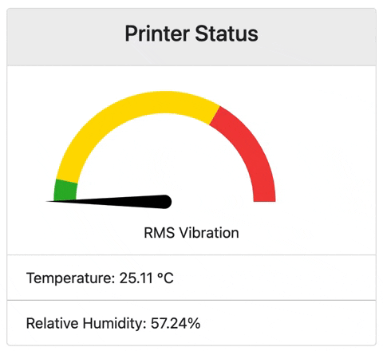
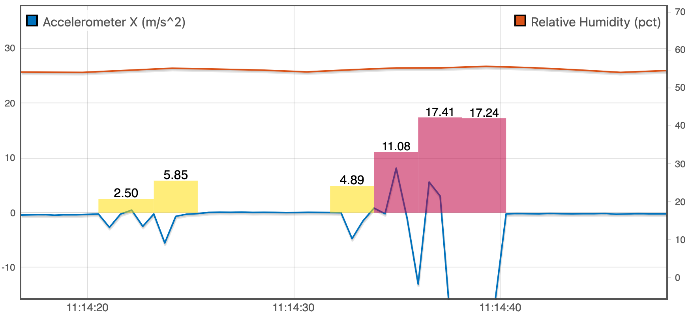

# Sensor Demo
This Data Application provides a simple dashboard to visualize environmental data collected by a BME280 and ICM20948 sensor. A gauge shows RMS vibration in low, medium, and high range and the current temperature and humidity are displayed below. When the humidity rises above 75% the background is changed to red to indicate a potentially hazadous condition. 

## Usage
1. Configure the [BME280](/sensors/bme280/readme.md) and [ICM20948](/sensors/icm20948/readme.md) data readers and check the stream configuration matches the following setup. If you want a different configuration modify the ``module.conf`` file accordingly.
   
```shell
joule module list
╒═════════════════╤════════════════════════════════╤════════════════════════════════╕
│ Name            │ Inputs                         │ Outputs                        │
╞═════════════════╪════════════════════════════════╪════════════════════════════════╡
│ BME280 Reader   │                                │ /sensors/bme280                │
├─────────────────┼────────────────────────────────┼────────────────────────────────┤
│ ICM20948 Reader │                                │ /sensors/icm20948/acceleration │
│                 │                                │ /sensors/icm20948/gyro         │
│                 │                                │ /sensors/icm20948/magnetometer │
╘═════════════════╧════════════════════════════════╧════════════════════════════════╛
# Note: other modules may be included as well
```

2. This module does not produce any output streams so while it can be run directly in the shell there are no
   values displayed on stdout. If you are working on the local machine open http://localhost:8000 to view the page. Otherwise replace ``localhost`` with the appropriate IP address. This configuration is mostly useful during module development:
```shell
./app.py --module_config=./module.conf --live
starting web server at 0.0.0.0:8000
Running filter on live input data
starting web server at 0.0.0.0:8000
Running filter on live input data
# logs any high vibration events...
High vibration: 2.4989116191864014 m/s^2
High vibration: 5.850946426391602 m/s^2
High vibration: 4.885771751403809 m/s^2
# Ctrl-C to exit
```
   
3. Replace the **exec_cmd** parameter in ``module.conf`` with the full path to ``app.py`` and change any other settings to customize your configuration:
   
```ini
name = Sensor Demo
# set this to the absolute path of app.py
exec_cmd = /path/to/app.py <=== change this
is_app = yes

...more configuration...
```
  
5. Copy ``module.conf`` to ``/etc/joule/module_configs`` to add this module to Joule:
```shell
    sudo cp module.conf /etc/joule/module_configs/sensor_demo.conf
    sudo service joule restart
    joule module list # ensure Sensor Demo is listed in the output
```

## Demo
Refresh the Lumen node to add the Sensor Demo app. The dashboard shows the current sensor readings and any high vibration events are added to an event stream which can be displayed
along with the sensor data streams as shown below:




**Event Stream plotted with Accelerometer Data:** To create this plot add two copies of the high vibration event stream and use the filter to display medium vibration ``1<X<=10`` with a yellow background and high vibration ``x>10`` with a red background. The event height is set to the vibration level and associated with the same axis as the accelerometer stream (in this case the left axis). 



